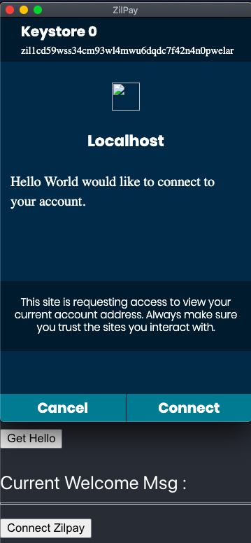
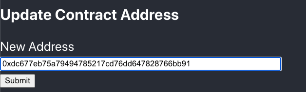
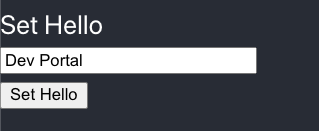

# Hello World Scilla Front-End

## About

This repo contains the front-end code for interacting with the hello-world scilla contract. This example allows the contract owner to set the welcome msg using the setHello transition which can then be retrieved by anyone using getHello transition. You need to have [zilpay](https://zilpay.xyz) installed in order to play with this example. 

The Js-framework used in this example is React but the zilliqa related code is written in VanillaJS and can be used as such with another framework like Angular, Vue etc.

## Setup

```
git clone https://github.com/arnavvohra/dev-portal-examples.git
cd dev-portal-examples/hello-world
npm install
npm start
```
## Steps To Use The Demo


1. Connect zilpay



2. Update contract address to your Hello World contract address



3. Set Welcome Msg by calling Set Hello



4. Retrieve Welcome Msg by calling Get Hello


5. The Welcome Msg gets updated!

