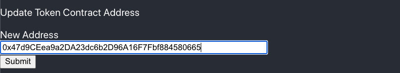
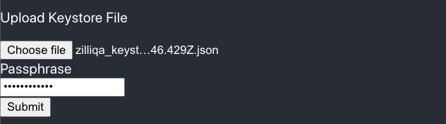
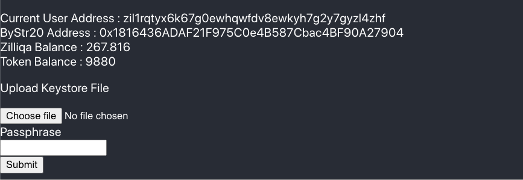
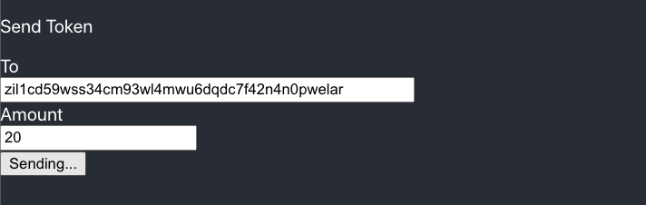

# ZRC2 Wallet

## About

This repo contains the code for a zrc2 wallet, which allows a user to send and receive zrc2 tokens on the Zilliqa developer testnet (https://dev-api.zilliqa.com/).
The Js-framework used in this example is React but the zilliqa related code is written in VanillaJS and can be used as such with another framework like Angular, Vue etc.

## Setup

```
git clone https://github.com/arnavvohra/dev-portal-examples.git
cd dev-portal-examples/zrc-2-wallet
npm install
npm start
```
## Steps To Use The Demo


1. Update token address



2. Upload keystore file and enter the corresponding passphrase



3. After uploading the keystore file you can see your zil and token balance respectively



4. Send token by specifying the receiving address and amount



5. After the transaction is confirmed your token and zil balances get updated automatically!

